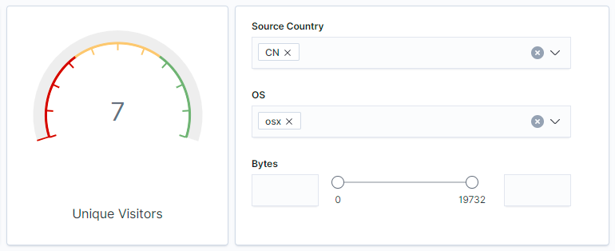
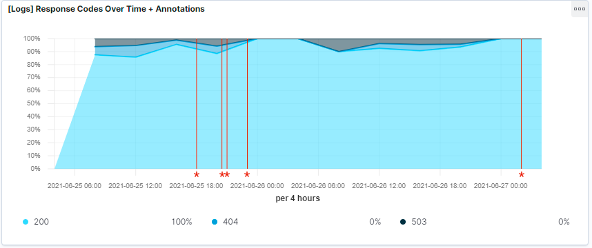
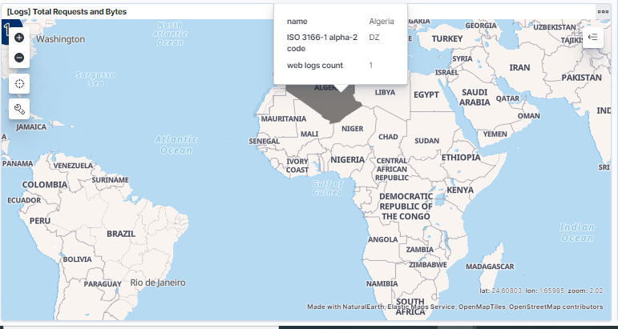

## Activity File: Exploring Kibana

* You are a DevOps professional and have set up monitoring for one of your web servers. You are collecting all sorts of web log data and it is your job to review the data regularly to make sure everything is running smoothly. 

* Today, you notice something strange in the logs and you want to take a closer look.

* Your task: Explore the web server logs to see if there's anything unusual. Specifically, you will:

:warning: **Heads Up**: These sample logs are specific to the time you view them. As such, your answers will be different from the answers provided in the solution file. 

---

### Instructions

1. Add the sample web log data to Kibana.

- Surf to the ELK Server's Publice IP that is Kibana's Home Page `http://20.81.128.7:5601/app/kibana` 
    
   - Click on `Load a data set and a Kibana dashboard` under `Add sample data`
   - Click `Add data` under the `Sample web logs` data pane
   - Click `View Data` to pull up the dashboard

2. Answer the following questions:

 - In the last 7 days, how many unique visitors were located in India?
   - **237**

 - In the last 24 hours, of the visitors from China, how many were using Mac OSX?
   - **7**

 - In the last 2 days, what percentage of visitors received 404 errors? How about 503 errors?
   - **404 Errors:** 0%
   - **503 Errors:** 0%

 - In the last 7 days, what country produced the majority of the traffic on the website?
   - **China** 20.9%

 - Of the traffic that's coming from that country, what time of day had the highest amount of activity?
   - **China** at **10:00AM**

 
 - List all the types of downloaded files that have been identified for the last 7 days, along with a short description of each file type (use Google if you aren't sure about a particular file type).

   - _`Blank`_ - These are not well known type file downloads
   - `gz` - Compressed file (generally Unix/Linux/MacOS format)
   - `css` - Cascaded Style Sheet used for web page theme and decoration
   - `deb` - Compressed linux software package for debian-based distributions  
   - `zip` - Compressed archive (usually Microsoft Windows)
   - `rpm` - Compressed linux software package introduced by RedHat Linus Distribution (rpm - RedHat Package Manager)

3. Now that you have a feel for the data, Let's dive a bit deeper. Look at the chart that shows Unique Visitors Vs. Average Bytes.
   - Locate the time frame in the last 7 days with the most amount of bytes (activity).
    - **Avg Bytes:** 9,000 (Approximately)
    - **Unique Visitor(s):** 2

    
   - In your own words, is there anything that seems potentially strange about this activity?
     - **The graph shows that only one visitor appeared during this time compared with other occasions. This may be indicative of a user who might be conducting some sort of malicious activity. Further research is required to rule out an incidence of false positives.**

4. Filter the data by this event.
  - What is the timestamp for this event?
    - **Timestamp for the Spike:** 2021-06-27 07:36:55 (precisely with unique user count 1) 

 
  - What kind of file was downloaded?
    - **zip files** along with some other unknown file type(s)

  - From what country did this activity originate? 
    - **Algeria** 

   - What HTTP response codes were encountered by this visitor? kibana-max-bytes-response-type.png
     - **200**

     

5. Switch to the Kibana Discover page to see more details about this activity.
  - What is the source IP address of this activity?
    - **19.112.190.54** 
    
  - What are the geo coordinates of this activity?
    - **"lat": 40.88544444, "lon": -83.86863889**

  - What OS was the source machine running?
    - **ios**

  - What is the full URL that was accessed?
    - **https://www.elastic.co/downloads/apm**

  - From what website did the visitor's traffic originate?
    - **http://twitter.com/success/thomas-reiter**  kibana-max-bytes-geo.png

     

6. Finish your investigation with a short overview of your insights. 

     - What do you think the user was doing?
     - Was the file they downloaded malicious? If not, what is the file used for?
     - Is there anything that seems suspicious about this activity?
     - Is any of the traffic you inspected potentially outside of compliance guidlines?

---
© 2020 Trilogy Education Services, a 2U, Inc. brand. All Rights Reserved.  
