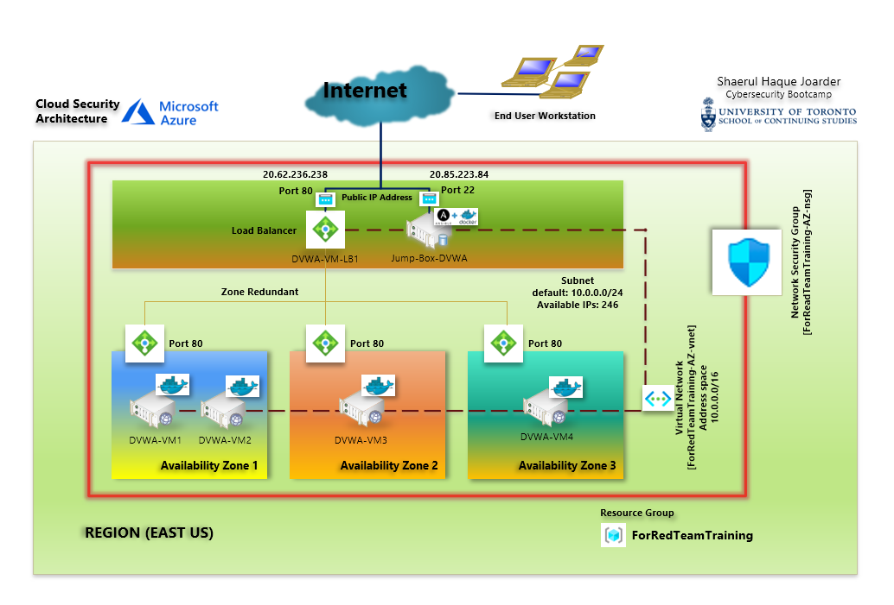

# ELK-Stack-Project
The diagram below is the **Cloud Security Architecture** to be implemented on Microsoft Azure to prepare a reliable, secure and available infrastructrure (Basically a software defined Data Center or SDDC) for running and ELK Stack (Elasticsearch+Logstash+Kibana). This is a precursor to successful SIEM for SoC operations a part of Enterprise Security Management or ESM.

The step by step tasks to achevie the Project Goal were done in following few steps

1. Creating a new Linux (Ubuntu 20x) VM to run ELK Stack dockerized container in the created Available, Reliable and Secure Cloud IT Infrastructure (done in the previous class works) in **Microsoft Azure Public Cloud**
1. Provisioning ELK Stack container in **Microsoft Azure Public Cloud** in a different Azure Region and Availability Zone
2. Provisioning ELK Stack with Ansible playbook (IaC - Infrastructure as Code)
3. Provisioning Filebeat and Metricbeat with Ansible playbook in DVWA VMs
4. Performing a self User Acceptance Test (UAT) as a Part of QA (Quality Assurance)

The following **.yml** config files have been tested and used for **Ansible** to generate a live ELK Stack deployment on **Azure** from Jump Box VM. They can be used to either recreate the entire deployment pictured above. Alternatively, select portions of the **_x.yml_** may be used to install only certain pieces of it, such as Filebeat.

- [Provisioning DVWA Webserver Docker Container](Ansible/roles/install-dvwa-for-pentest-playbook.yml)
- [Provisioning ELK Stack Docker Container](Ansible/roles/install-elk-stack-playbook.yml)
- [Installing Filebeat collector agent](Ansible/roles/install-filebeat-collector-for-elk-playbook.yml)
- [Installing Metricbeat collector agent](Ansible/roles/install-metricbeat-collector-for-elk-playbook.yml)

This document Covers the following details:

- Description of the Topology
- Access Policies
- ELK Configuration
   - **_Filebeat_** Applicaton and system Log files being collected
   - **_Metricbeat_** VMs Being Monitored
- How to Use the Ansible Build

### Description of the Topology

Practically in a Software Defined Data Center hosted in a public or private cloud must have the four critical attributes 

- Security
- Scalabality
- Reliability
- Availability

The above base diagram plotted as **Cloud Security Architecture** has covered all the above criteria. Most of the attributes have been inherited from the Azure Cloud iteself and the rest have been configured reasonablity as much as required by the Project Objective. Too much Security hardening might have restricted us from getting the intended result.

| Name        | Description                                    | 
|------------ |:-----------------------------------------------|
| Security    | - Network Security Group                       |
|             | - Containerized Applicaton (Apache, MySQL)                         |
|             | - Reverse Proxy (Load Balancer)                |
| Scalability | Inherited from Azure                           |  
| Reliablity  | Inherited from Azure                           | 
| Availability| - Load Balancer                                |    
|             | - Availability zones accross different region  |

The main purpose of this network is to expose a load-balanced and monitored instance of DVWA, the D*mn Vulnerable Web Application.

Load balancing ensures that the application will be highly _____, in addition to restricting _____ to the network.
- _TODO: What aspect of security do load balancers protect? What is the advantage of a jump box?_

Integrating an ELK server allows users to easily monitor the vulnerable VMs for changes to the _____ and system _____.
- _TODO: What does Filebeat watch for?_
- _TODO: What does Metricbeat record?_

The configuration details of each machine may be found below.
_Note: Use the [Markdown Table Generator](http://www.tablesgenerator.com/markdown_tables) to add/remove values from the table_.

| Name     | Function | IP Address | Operating System |
|----------|----------|------------|------------------|
| Jump Box | Gateway  | 10.0.0.1   | Linux            |
| TODO     |          |            |                  |
| TODO     |          |            |                  |
| TODO     |          |            |                  |

### Access Policies

The machines on the internal network are not exposed to the public Internet. 

Only the _____ machine can accept connections from the Internet. Access to this machine is only allowed from the following IP addresses:
- _TODO: Add whitelisted IP addresses_

Machines within the network can only be accessed by _____.
- _TODO: Which machine did you allow to access your ELK VM? What was its IP address?_

A summary of the access policies in place can be found in the table below.

| Name     | Publicly Accessible | Allowed IP Addresses |
|----------|---------------------|----------------------|
| Jump Box | Yes/No              | 10.0.0.1 10.0.0.2    |
|          |                     |                      |
|          |                     |                      |

### Elk Configuration

Ansible was used to automate configuration of the ELK machine. No configuration was performed manually, which is advantageous because...
- _TODO: What is the main advantage of automating configuration with Ansible?_

The playbook implements the following tasks:
- _TODO: In 3-5 bullets, explain the steps of the ELK installation play. E.g., install Docker; download image; etc._
- ...
- ...

The following screenshot displays the result of running `docker ps` after successfully configuring the ELK instance.

### Target Machines & Beats
This ELK server is configured to monitor the following machines:
- _TODO: List the IP addresses of the machines you are monitoring_

We have installed the following Beats on these machines:
- _TODO: Specify which Beats you successfully installed_

These Beats allow us to collect the following information from each machine:
- _TODO: In 1-2 sentences, explain what kind of data each beat collects, and provide 1 example of what you expect to see. E.g., `Winlogbeat` collects Windows logs, which we use to track user logon events, etc._

### Using the Playbook
In order to use the playbook, you will need to have an Ansible control node already configured. Assuming you have such a control node provisioned: 

SSH into the control node and follow the steps below:
- Copy the _____ file to _____.
- Update the _____ file to include...
- Run the playbook, and navigate to ____ to check that the installation worked as expected.

_TODO: Answer the following questions to fill in the blanks:_
- _Which file is the playbook? Where do you copy it?_
- _Which file do you update to make Ansible run the playbook on a specific machine? How do I specify which machine to install the ELK server on versus which to install Filebeat on?_
- _Which URL do you navigate to in order to check that the ELK server is running?

_As a **Bonus**, provide the specific commands the user will need to run to download the playbook, update the files, etc._

