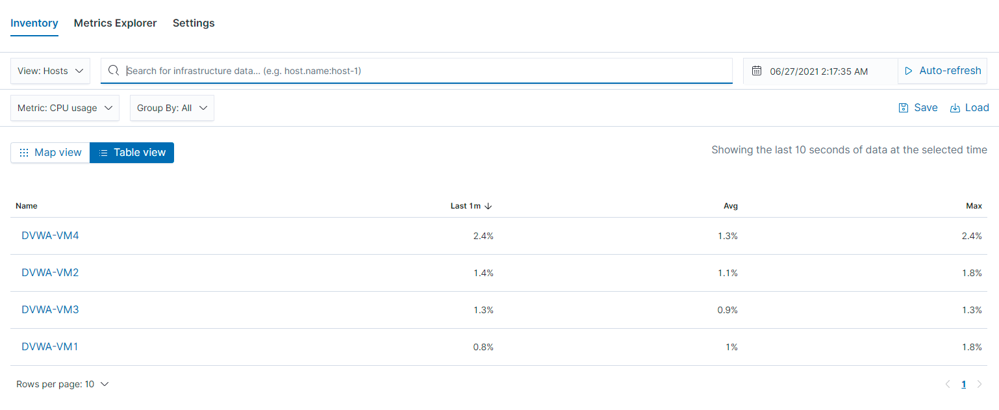
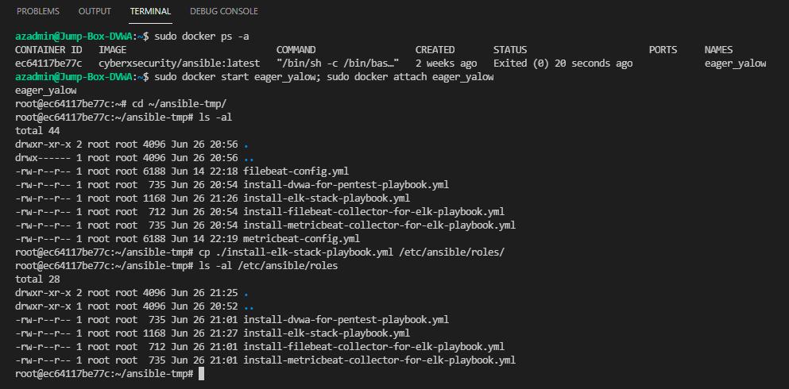

# ELK-Stack-Project
The diagram below is the **Cloud Security Architecture** to be implemented on Microsoft Azure to prepare a reliable, secure and available infrastructrure (Basically a software defined Data Center or SDDC) for running and ELK Stack (Elasticsearch+Logstash+Kibana). This is a precursor to successful SIEM for SoC operations a part of Enterprise Security Management or ESM.


The step by step tasks to achevie the Project Goal were done in following few steps

1. Creating a new Linux (Ubuntu 20x) VM to run ELK Stack dockerized container in the created Available, Reliable and Secure Cloud IT Infrastructure (done in the previous class works) in **Microsoft Azure Public Cloud**
1. Provisioning ELK Stack container in **Microsoft Azure Public Cloud** in a different Azure Region and Availability Zone
2. Provisioning ELK Stack with Ansible playbook (IaC - Infrastructure as Code)
3. Provisioning Filebeat and Metricbeat with Ansible playbook in DVWA VMs
4. Performing a self User Acceptance Test (UAT) as a Part of QA (Quality Assurance)

The following **.yml** config files have been tested and used for **Ansible** to generate a live ELK Stack deployment on **Azure** from Jump Box VM. They can be used to either recreate the entire deployment pictured above. Alternatively, select portions of the **_x.yml_** may be used to install only certain pieces of it, such as Filebeat.

- [Provisioning DVWA Webserver Docker Container](Ansible/roles/install-dvwa-for-pentest-playbook.yml)
- [Provisioning ELK Stack Docker Container](Ansible/roles/install-elk-stack-playbook.yml)
- [Installing Filebeat collector agent](Ansible/roles/install-filebeat-collector-for-elk-playbook.yml)
- [Installing Metricbeat collector agent](Ansible/roles/install-metricbeat-collector-for-elk-playbook.yml)

This document Covers the following details:

- Description of the Topology
- Access Policies
- ELK Configuration
   - **_Filebeat_** Applicaton and system Log files being collected
   - **_Metricbeat_** VMs Being Monitored
- How to Use the Ansible Build

### Description of the Topology

Practically in a Software Defined Data Center hosted in a public or private cloud must have the four critical attributes 

- Security
- Scalabality
- Reliability
- Availability

The above base diagram plotted as **Cloud Security Architecture** has covered all the above criteria. Most of the attributes have been inherited from the Azure Cloud iteself and the rest have been configured reasonablity as much as required by the Project Objective. Too much Security hardening might have restricted us from getting the intended result.

| Name        | Description                                    | 
|------------ |:-----------------------------------------------|
| Security    | - Network Security Group                       |
|             | - Access List                                  |
|             | - Containerized Applicaton (Apache, MySQL)     |
|             | - Reverse Proxy (Load Balancer)                |
|             | - Jump Box                                     |
| Scalability | - Fastest Deployment with IaC (Ansible)                          
|             | - Inherited from Azure                         |
| Reliablity  | - Inherited from Azure                         | 
| Availability| - Load Balancer                                |    
|             | - Availability Zones accross multiple Regions  |

The ultimate objective of this Project lab setup is to expose a load-balanced and monitored instance of DVWA the D*mn Vulnerable Web Application.

**Jump Box**
Jump boxes are secure virtual machines that all administrators connect to before launching any administrative task or as a point of connection when connecting to other servers or untrusted environments.

**Load Balancer**
Load balancers are essentially reverse proxy servers, providing high availability, security and performance. The process of scaling out or adding more nodes is seamless and takes the shortest amount of time. Furthermore, it can distribute traffic among VMs in a weighted round robin manner. Also, load balancers can handle and offer fail-over stateful connections, such as paypal or credit/debit card transactions.

**Monitoring**
The Monitoring system allows seamleass monitoring of vulnerable DVWAs through continuously collecting the changed log files and system metrics. For this pupose an ELK (Elasticsearch + Logstash + Kibana) Stack has been provisioned using Ansible from Jump Box in a seperate VM residing in a different region. ELK stack is the world’s most popular log management platform. Elastic's ELK Stack consists of three open-source products - Elasticsearch, Logstash, and Kibana - all developed, managed, and maintained by Elastic. Beats (e.g. filebeat, metricbeat) turned the stack into a four-legged project after its introduction and subsequent addition.


| Component     | Description                                 |
|---------------|---------------------------------------------|
| Filebeat      |A "Lightweight shipper for forwarding and centralizing log data". It helps you keep the simple things simple by offering a lightweight way to forward and centralize logs and files|
| Metricbeat    | A "Lightweight Shipper for Metrics". Collect metrics from your systems and services. From CPU to memory, Redis to NGINX, and much more, It is a lightweight way to send system and service statistics|
| Logstash      | Takes care of collected data from Beats and starts further processing|
| Elasticsearch | Indexes and stores the proecessed data|
| Kibana        | Provides a user interface for querying the data and visualizing it|


The configuration details of each Virtual Machine:

| Vitual Machine          | Function     | Private IP | Public IP    | Load Balancer IP | Operating System      | Region      | Availibility Zone |
|-------------------------|--------------|------------|:------------:|------------------|:----------------------|-------------|:-----------------:|
| Jump-Box-DVWA           | Jump Box     | 10.0.0.6   | 20.85.223.84 |                  | 20.04.1-Ubuntu        | EAST US     | None              |
| DVWA-VM1                | LAMP Server  | 10.0.0.4   | N/A          | 20.62.236.238    | 20.04.1-Ubuntu        | EAST US     | 1                 |
| DVWA-VM2                | LAMP Server  | 10.0.0.5   | N/A          | 20.62.236.238    | 20.04.1-Ubuntu        | EAST US     | 1                 |
| DVWA-VM3                | LAMP Server  | 10.0.0.8   | N/A          | 20.62.236.238    | 20.04.1-Ubuntu        | EAST US     | 2                 |
| DVWA-VM4                | LAMP Server  | 10.0.0.9   | N/A          | 20.62.236.238    | 20.04.1-Ubuntu        | EAST US     | 3                 |
| RedTeamTraining-ELK-VM1 | ELK Stack    | 10.1.0.4   | 20.81.128.7 |                   | 20.04.1-Ubuntu        | EAST US 2   | 1                 |


### Access Policies

The machines on the internal network are not exposed to the public Internet. 

Only the **Jump-Box-DVWA** and **RedTeamTraining-ELK-VM1** Machines can accept connections from the Internet. Access to this machine is only allowed from the following IP addresses:

**27.147.187.239** is my Public Static IP address provided by my Internet Service Provider.

Machines within the network can only be accessed by **Jump-Box-DVWA** (PUblic IP Address 20.81.128.7)

**RedTeamTraining-ELK-VM1** is accesible through virtual private network on SSH Port 22 only from **Jump-Box-DVWA** (Private IP Address 10.0.0.6)

**RedTeamTraining-ELK-VM1** is accesible through custom HTTP Port 5601 **(Kibana)** only from my public IP Address **27.147.187.239**

A summary of the access policies in place can be found in the table below.

| Name/Destination        | Publicly Accessible | Allowed Source Address | Port | Service |
|-------------------------|---------------------|------------------------|:----:|:-------:|
| Jump-Box-DVWA           | Yes                 | 27.147.187.239         | 22   | SSH     |
| RedTeamTraining-ELK-VM1 | Yes                 | 27.147.187.239         | 5601 | HTTP    |
| DVWA-VM1                | No                  | 10.0.0.6               | 22   | SSH     |
| DVWA-VM2                | No                  | 10.0.0.6               | 22   | SSH     | 
| DVWA-VM3                | No                  | 10.0.0.6               | 22   | SSH     | 
| DVWA-VM4                | No                  | 10.0.0.6               | 22   | SSH     |
| DVWA-VM-LB1             | Yes                 | 27.147.187.239         | 80   | HTTP    | 

**Note:** **DVWA-VM-LB1** is the Load Balancer that distributes the incoming traffic at HTTP Port 80 equally among four DVWA VMs' Port 80. 

### Elk Configuration

Ansible has been used here, which is basically an open-source software tool for provisioning, configuration management, and application-deployment enabling infrastructure as code **(IaC)**. Although it is very simple to use, this tool is capable of automating multi-tier IT environments that are quite complex in nature.

Leveraging Ansible's powerful capability we configured and deployed ELK Stack Docker Container just by creating **.yml** configuration files at **Jump Box DVWA VM** and by running `ansible-playbook` very quickly and seamlessly.

The playbook implements the following tasks:

- Configure Maximum mapped Memory with `sysctl`
- Install `docker.io` package with *_apt_* module
- Install `python3-pip` package with *_apt_* module
- Install **Docker SDK** for python using `pip`
- Download and launch a **ELK Stack** container with `docker-container`
- Enable service **docker** on boot with `systemd` (automatically start after system reboot and/or container restart)

The following screenshot displays the result of running `docker ps -a` after successfully configuring the ELK instance.


### Target Machines & Beats
This ELK server is configured to monitor the following machines:

| DVWA Virtual Machine    | Private IP Address | 
|-------------------------|--------------------|
| DVWA-VM1                | 10.0.0.4           |
| DVWA-VM2                | 10.0.0.5           | 
| DVWA-VM3                | 10.0.0.8           | 
| DVWA-VM4                | 10.0.0.9           |

Among 7 members (Filebeat, Metricbeat, Packetbeat, Winlogbeat, Auditbeat and Heartbeat) of **Beat Family** used at end-points for collective varous data we have installed here two members for our Linux Operating System based VMs

- **Filebeat**: Lightweight shipper for logs and other data. Filebeat parses and forwards data from the Web VMs in an easy-to-read format to the ELK Stack VM.
- **Metricbeat**: Lightweight shipper for metric data. Metricbeat reports system statistics and performance metrics about the Web VMs to the ELK stack VM.

**Note:** **Winlogbeat** is a Lightweight shipper specially designed for Windows not installed here as we don't have any Windows VM.

**Filebeat Example:** Live Screenshots from deployed ELK Stac's Kibana


**Metricbeat Example:** Live Screenshots from deployed ELK Stac's Kibana




### Using the ELK Stack Playbook
In order to use the playbook, you will need to have an Ansible control node already configured. Assuming you have such a control node provisioned: 

SSH into the control node and follow the steps below:

- Copy the `install-elk-stack-playbook.yml` playbook file to `/etc/ansible/roles/`


 
- **Alternatively** Copy the [install-elk-stack-playbook.yml](Ansible/roles/install-elk-stack-playbook.yml) playbook file from outside container to `eager_yalow:/etc/ansible/roles/`
      


- Update the [/etc/ansible/hosts](Ansible/hosts) file to include the ELK stack VM Private IP address.
  - Append `ansible_python_interpreter=/usr/bin/python3` to ensure that the
      correct version of python is used.


- Run the playbook, and navigate to `http://[your.elk.ip]:5601/app/kibana.` to check that the installation worked as expected.

    - `$ ansible-playbook /etc/ansible/roles/elk-stack-playbook.yml`


### Using the Metricbeat and Filebeat Playbooks

#### Filebeat 

- Edit [/etc/ansible/files/filebeat-config.yml](Ansible/files/filebeat-config.yml) in the ansible container on the control node to include the ELK Stack IP address. You should also change the default login credentials.

```yml
output.elasticsearch:
hosts: ["<elk.ip.addr>:9200"]
username: "elastic"
password: "changeme"
```
```yml
setup.kibana:
host: "<elk.ip.addr>:5601"
```

- Then run the playbook 
  - `$ ansible-playbook /etc/ansible/roles/filebeat-playbook.yml`


#### Metricbeat

- Edit [/etc/ansible/files/metricbeat-config.yml](Ansible/files/metricbeat-config.yml) in the ansible on the control node to include the ELK Stack IP address. You should also change the default login credentials.

```yml
output.elasticsearch:
hosts: ["<elk.ip.addr>:9200"]
username: "elastic"
password: "changeme"
```
```yml
setup.kibana:
host: "<elk.ip.addr>:5601"
```
		
- Then run the playbook 
  - `$ ansible-playbook /etc/ansible/roles/metricbeat-playbook.yml`
